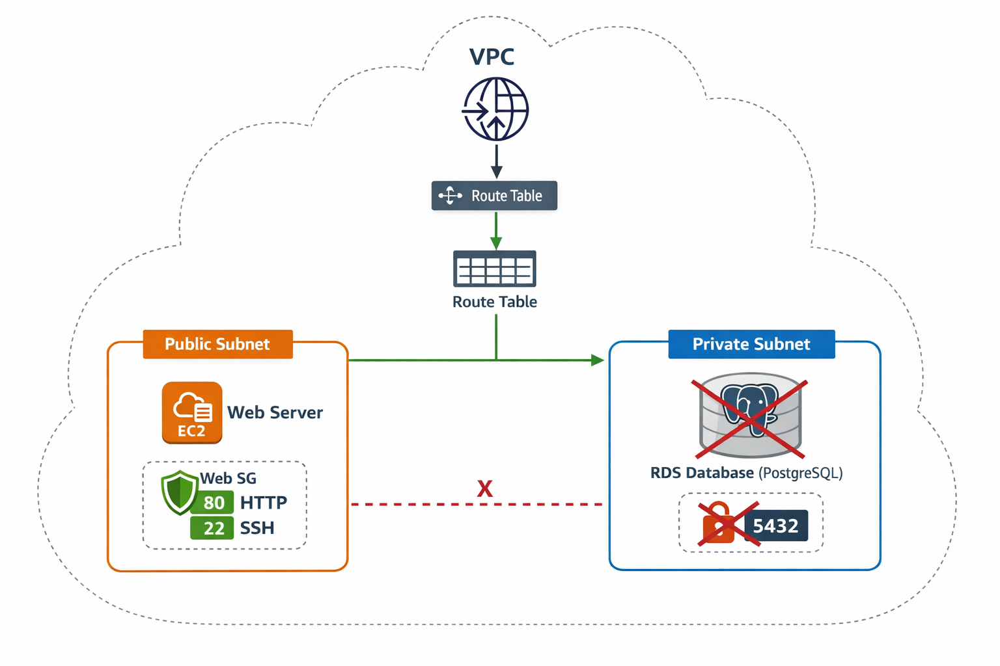

# Phase 4 – Project 3: Multi-tier Web App (Terraform + AWS)
# Phase 4 – Project 3: Multi-tier Web App (Terraform + AWS)



This project demonstrates a **multi-tier web application architecture** deployed on **AWS** using **Terraform**. 

## Project Overview

- **VPC:** Custom VPC with public and private subnets.  
- **Public Subnet:** Hosts EC2 web server.  
- **Private Subnet:** Reserved for RDS database (currently commented out for demo).  
- **Security Groups:** Web server SG allows HTTP & SSH; DB SG configured for future database access.  
- **Internet Gateway & Route Table:** Ensures public subnet can reach the Internet.  
- **Outputs:** Public IP of EC2 web server for verification.

## Architecture

- **Public Subnet:** EC2 instance running the web server.  
- **Private Subnet:** Reserved for database.  
- **Traffic Flow:** Internet → IGW → Public Subnet → EC2.  
- **Security Groups:** Properly scoped to allow web traffic and future DB access.  

The architecture diagram above shows a clean, professional visualization of the setup.

## Terraform Usage

### Requirements

- Terraform >= 1.5.0  
- AWS CLI configured with your credentials  
- AWS Key Pair named `phase4-key`  

### Steps

1. Initialize Terraform:

```bash
terraform init
